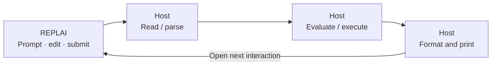

<p align="center">
  
</p>

<h1 align="center">REPLAI</h1>

<p align="center">
  <strong>Terminal interaction for applications that own their loop.</strong><br>
  Unicode editing · Terminal-native presentation · Rust and C
</p>

<p align="center">
  <a href="https://github.com/mothx9/replai/actions/workflows/ci.yml"></a>
  <a href="LICENSE">MIT License</a> ·
  <a href="docs/README.md">Documentation</a> ·
  <a href="examples/demo.rs">Rust example</a> ·
  <a href="examples/c/demo.c">C example</a>
</p>

REPLAI is an embeddable terminal interaction library for line-oriented command
interfaces. It handles the editable draft and the terminal around it: Unicode
cursor movement, history navigation, multiline paste, completion requests,
redraw, and restoration when an interaction ends.

Your application supplies the prompt, decides what the input means, and keeps
control of execution. An interpreter, database shell, debugger or developer tool
can use the same interaction machinery with its own language and policies.

**Pre-release · Linux-qualified.** The Rust API and C ABI 1 are experimental.
Use an exact revision; no stable API/ABI or published crate release is promised.
See [project status](ROADMAP.md) for demonstrated scope and current limits.

## The boundary that matters

A prompt is easy to print. Keeping a partially edited Unicode draft intact
through history recall, pasted newlines, a terminal resize or an arriving notice
requires coordinated editing state, display geometry and terminal ownership.
REPLAI brings those mechanisms together behind a host-driven interface.

| During an interaction | REPLAI's responsibility | The host's decision |
| --- | --- | --- |
| Editing a draft | Bounded UTF-8 text; grapheme movement and deletion | Input meaning and validation |
| Recalling input | History navigation; return to the original draft and cursor | Admission, retention and persistence |
| Pasting multiple lines | Bracketed framing; normalized newlines; one draft until Enter | What the submitted text executes |
| Requesting completion | Typed request; validated replacement and redraw | Candidate discovery and selection |
| Receiving external output | Write a safe text line; restore the draft and cursor | Content and scheduling |
| Submitting, interrupting or reaching EOF | Distinct outcomes; close and restore captured terminal state | Execute, cancel, retry or exit |

The library supplies a line-oriented editing surface with an accented prompt,
compact continuation lines and generic text roles. It uses the terminal's
default background and scrollback, with no alternate screen. `NO_COLOR` and
`TERM=dumb` disable styling; Unicode cells and multiline redraw are handled by
the same renderer for Rust and C.

[Interaction contracts](docs/interaction.md) define the behavior and failure
rules. [Presentation](docs/presentation.md) defines the visual grammar, exact
reference comparisons and terminal/emulator limits.

## A classical REPL, with an explicit terminal boundary

The **Read–Eval–Print Loop** reads an expression, evaluates it in an environment,
prints a result, then returns to the next input. REPLAI provides the editable
terminal input and its lifecycle. Parsing, evaluation and semantic result
formatting belong to the host.



This separation follows the evaluator-driver structure taught in
[SICP §4.1.4](https://sicp.sourceacademy.org/chapters/4.1.4.html) and the
application/editor boundary illustrated by
[GNU Readline's programming interface](https://web.mit.edu/gnu/doc/html/rlman_2.html).
These are architectural references, not API-compatibility claims.

[The REPL guide](docs/repl.md) develops the classical cycle with a worked
example, the host/library sequence and primary references, including McCarthy's
1960 paper on symbolic evaluation. [Architecture](docs/architecture.md) maps
that boundary to REPLAI's safe Rust implementation and separate C binding.

## Try the interaction

From a checkout, on Linux with stable Rust and an interactive ANSI/VT-compatible
terminal:

```sh
cargo run --locked --example demo
```

```text
demo> hello
echo: hello

demo> 界
... café
echo: 界
café

demo>
```

The second interaction illustrates a bracketed multiline paste, submitted once.
Try `wor` followed by Tab for host-selected completion, or type a draft and use
Up then Down to return to it. To see output arrive while you are editing:

```sh
cargo run --locked --example demo -- --notice
```

A notice appears after two seconds; the unfinished draft and cursor survive.
Ctrl-C interrupts editing. Ctrl-D exits on an empty draft, and otherwise deletes
the next grapheme. The example owns these loop decisions and history admission.

## Embed in Rust

An `Interaction` owns the editor and acquires a terminal only while editing.
The host polls events and decides when to open the next interaction. For example,
this program reads one submitted input, keeping interruption and EOF distinct:

```rust
use replai::{Editor, Event, Interaction, Prompt, Role};
use std::time::Duration;

fn main() -> Result<(), Box<dyn std::error::Error>> {
    let mut input = Interaction::new(Editor::new(65_536, 100));
    input.open(&std::io::stdin(), &std::io::stdout(), Prompt::new("demo")?)?;

    loop {
        match input.poll(Duration::from_millis(100))? {
            Some(Event::Submitted(text)) => {
                println!("received: {text}"); // The terminal is already restored.
                break;
            }
            Some(Event::Interrupted) => break,
            Some(Event::EndOfInput) => break,
            Some(Event::CompletionRequested) => {} // This host declines completion.
            Some(Event::Rejected(error)) => {
                input.external_output(Role::Warning, &error.to_string())?;
            }
            None => {}
        }
    }
    Ok(())
}
```

The [complete Rust example](examples/demo.rs) adds completion, explicit history
admission and reopen behavior. Generate method documentation with
`cargo doc --no-deps`. Hosts keep their application loop; no callback framework
or asynchronous runtime is required.

## Embed in C

The separate `replai-c` binding consumes the public Rust API. It exposes ABI 1
through opaque handles, typed integer events and caller-owned UTF-8 buffers.
Both language interfaces use one editor and renderer.

Build the producer artifacts and stage them into an absent or empty prefix:

```sh
cargo build --locked --release -p replai-c
python3 tools/stage_c.py --prefix /tmp/replai-install
```

The installation provides `replai.h`, `libreplai_c.a`, `libreplai_c.so` and the
`replai` pkg-config package. A C consumer needs only those installed artifacts
and its native toolchain; it does not need Cargo or access to Rust source.

[The C guide](docs/c-api.md) gives exact static/shared link commands, the
create → open → poll → close/reopen → destroy lifecycle, and ownership/error
rules. [The C example](examples/c/demo.c) demonstrates the complete host loop.

## Evidence and further reading

Qualification exercises both the safe Rust implementation and independently
compiled C processes. It observes submitted UTF-8 bytes, terminal cells and
cursor position, exact termios restoration, descriptor ownership, C/Rust ABI
layout, staged library resolution and memory-checker results. Real Linux PTYs
are part of both paths. [CI](https://github.com/mothx9/replai/actions/workflows/ci.yml)
keeps documentation, Rust and native-consumer gates visible separately.

| Continue with… | For… |
| --- | --- |
| [Documentation map](docs/README.md) | The authoritative document for each question |
| [REPL guide](docs/repl.md) | Classical foundations and the host interaction sequence |
| [Architecture](docs/architecture.md) | Modules, dependencies and safe/unsafe ownership |
| [Development](docs/development.md) | Reproducible checks and evidence requirements |
| [Contributing](CONTRIBUTING.md) | Proposing focused changes |
| [Project status](ROADMAP.md) · [Changelog](CHANGELOG.md) | Current limits, next work and consumer-visible changes |

## License

[MIT](LICENSE).
