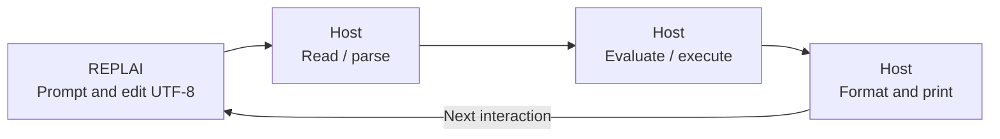

<p align="center">
  
</p>

# REPLAI

REPLAI is an embeddable terminal interaction library for building robust
line-oriented and REPL-style command interfaces.

**Early / pre-release:** a working Rust editor and Linux TTY backend are now
available, with a separately qualified C binding (pre-release ABI 1). Both
boundaries remain experimental; no stable ABI or crate release is promised.
Cargo publication remains disabled.

The editor supports grapheme movement and deletion, bounded UTF-8 drafts,
in-memory history with draft return, bracketed multiline paste, host completion,
interrupt/EOF delivery, resize and coordinated external output. Presentation
stays line-oriented: an accented prompt, compact continuation lines and the
terminal's default background. `NO_COLOR` and `TERM=dumb` disable text styling.

Hosts own the application loop, prompt content, command language, history
admission, completion candidates and the meaning of input and interrupts.
REPLAI is suitable for experimenting with interpreters, database and debugger
shells, developer tools and ordinary interactive command interfaces. It does
not supply application commands, a scheduler or a dashboard.

## Where REPLAI fits in a REPL

A **Read–Eval–Print Loop** repeatedly reads an expression, evaluates it in an
environment, and displays its result. The classic teaching reference is
[SICP §4.1.4](https://sicp.sourceacademy.org/chapters/4.1.4.html).
REPLAI supplies the terminal interaction part; the host supplies the language,
evaluation, result formatting and loop policy.



Editing text and reading a language expression are different operations. This
library/application separation also appears in
[GNU Readline's programming interface](https://web.mit.edu/gnu/doc/html/rlman_2.html).
See [the classical REPL and our design](docs/repl.md) for the complete teaching
diagram, a worked example, and references including McCarthy's 1960 paper.

## Try the reference fixture

On Linux, in an interactive ANSI/VT-compatible terminal:

```sh
cargo run --example demo
# Optional: a notice arrives after two seconds, preserving an unfinished draft.
cargo run --example demo -- --notice
```

```text
demo> hello
echo: hello

demo>
```

The [Rust example](examples/demo.rs) shows the host loop, completion and history
admission. Generate method documentation with `cargo doc --no-deps`; see the
[interaction contract](docs/interaction.md) for keys, lifecycle and failure rules.

## C consumers

Build and stage the header, static/shared libraries and pkg-config metadata:

```sh
cargo build --locked --release -p replai-c
python3 tools/stage_c.py --prefix /tmp/replai-install
```

Use an absent or empty prefix. The [C example](examples/c/demo.c) consumes only
installed artifacts. [C API and installation](docs/c-api.md) provides the exact
link commands, ABI ownership and error rules.

## Documentation and development

Start at the [documentation map](docs/README.md). It routes teaching, architecture,
interaction, presentation and C integration to their owning documents.
[Contributing](CONTRIBUTING.md) explains change admission;
[development](docs/development.md) gives the authoritative checks.
[Project status](ROADMAP.md) records demonstrated scope, limits and next work;
[the changelog](CHANGELOG.md) records externally meaningful changes.

Qualification covers deterministic Rust contracts, real Linux PTYs and isolated
installed C consumers, including ABI layout and memory ownership. See
[presentation evidence](docs/presentation.md) for exact byte/cell/cursor oracles.
Other OS backends, every terminal's Unicode/reflow behavior, an MSRV and
production maturity are not qualified.

## License

[MIT](LICENSE).
