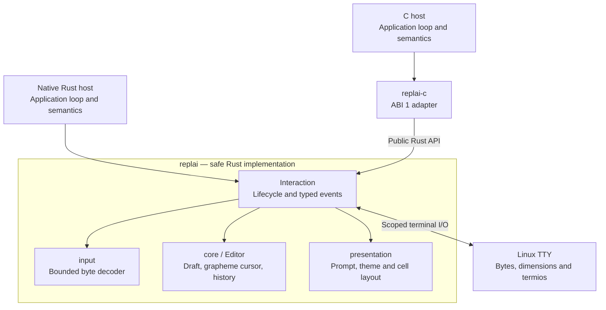

# Architecture and ownership

REPLAI implements terminal interaction in safe Rust. Native Rust hosts and the
separate C binding use the same editor, decoder, lifecycle and renderer.
[Project status](../ROADMAP.md) owns qualification and next-work boundaries;
[the REPL guide](repl.md) explains the classical interpreter cycle.

## Ownership and structure

Arrows show calls and ownership boundaries, not threads or a scheduler.
The public API delegates to private modules; neither host accesses their
internal decoder or layout state. Read/parse, evaluation and semantic result
formatting remain above both public boundaries.

| Implemented library mechanism | Host responsibility |
| --- | --- |
| Bounded text, grapheme cursor, insertion/deletion and navigation | Meaning, validation and execution of input |
| History navigation and preservation of the current draft | Admission, privacy, persistence, deduplication and retention choices |
| Input decoding, paste framing and key recognition | Application command language |
| Typed submit, interrupt, end-of-input and failure outcomes | Commit, cancel, retry, clear or exit decisions |
| Completion request and validated replacement | Candidates, vocabulary, eligibility, selection and lookup errors |
| Scoped terminal acquisition, restoration, resize and redraw | When editing begins and ends; coordinated access to the terminal |
| Generic style roles, prompt composition, continuation, spacing and line surface | Actual labels, suffix values, messages and their semantic meaning |
| Synchronous external text output with draft/cursor restoration | Content, scheduling and application operations |

**Generic terminal presentation is library-owned**; semantic rendering remains
host-owned. Consumers can replace their generic prompt/palette/redraw infrastructure instead of retaining
a second terminal template. Terminal I/O is the only library effect; application
storage, filesystem actions, networking and command registries remain external.

Private modules follow demonstrated dependencies:

- `core`: deterministic `Editor`, bounded history and edit errors. No FDs,
  callbacks, signals, clocks, environment reads or process globals.
- `input`: incremental bounded byte decoder producing private key actions.
  Expiration is explicit input from the adapter; no clock lives in this module.
- `presentation`: generic `Prompt`, `Theme`, `Role` and private cell layout.
  Layout consumes core state. Only explicit theme environment resolution reads
  `NO_COLOR`/`TERM`; the renderer itself has no I/O.
- `terminal`: Linux FD/termios lifecycle, polling, interaction events, completion
  transactions and output coordination. No separately exported internal modules.

## Composition and public boundaries

`Interaction` owns an `Editor` and an optional terminal resource independently.
The resource borrows editing state for individual operations, not for its stored
lifetime. Closing and reopening retains the editor and admitted history. This
composition supports movable Rust owners and opaque C handles without lifetime
fabrication. The former lifetime-bound `Terminal<'a>` API was replaced for this
ownership reason; it is not an alternative supported composition.

The public Rust exports are `Editor`, `EditError`, `Prompt`, `Theme`, `Role`,
and, on Linux, `Interaction`, `Event`, `Error`. Private modules are not a binding
interface. Rustdoc owns individual method signatures. The
[interaction contract](interaction.md) owns lifecycle, Unicode, input and events;
[presentation](presentation.md) owns the visible terminal surface.

The `replai-c` workspace package consumes only these public Rust exports. It
adapts records, pointers and statuses; it contains no second editor or renderer.
[The ABI schema](../api/c-abi.json) owns declarations; generated headers, records,
signature assertions and C/Rust layout probes are checked for drift. The
[C contract](c-api.md) defines caller serialization, exact handle/FD/buffer
ownership, panic containment and installation.

## Safe and unsafe boundary

The implementation crate forbids unsafe code and requires public documentation.
Only the C binding admits narrowly justified unsafe operations: raw spans and
output pointers, opaque allocation access/release, and borrowed FD construction
after validation. Each block has a local safety argument and
`unsafe_op_in_unsafe_fn` is denied. Editor, decoder, geometry and terminal logic
remain behind the safe public API. No fabricated static lifetimes are used.

## Dependencies

[Cargo.toml](../Cargo.toml) owns requested versions and features;
[Cargo.lock](../Cargo.lock) owns the repository's exact resolution. A downstream
Rust host resolves its own graph. No third-party type enters the public API.

| Dependency | Correctness responsibility absent from std | License selection | Scope |
| --- | --- | --- | --- |
| `rustix` | Safe Linux termios, FD identity and poll; PTYs for tests | MIT option | Implementation; PTY feature is test-only |
| `unicode-segmentation` | Extended grapheme boundaries | MIT option | Deterministic editing |
| `unicode-width` | Unicode cell-width estimates | MIT option | Presentation |
| `vt100` | Independent ANSI/VT cell, style and cursor oracle | MIT | Tests only |
| `libc` | Fallible integer FD validation with F_GETFD before borrowing | MIT option | C binding only |

The locked transitive Rust graph offers MIT-compatible licensing. Dependency
changes require a fresh license/source review. There are no application source
or sibling-checkout dependencies, custom core build script or async runtime.
Documentation tooling uses a separate locked Mermaid/DOM parser installation;
it never participates in Cargo builds or installed native consumer artifacts.
