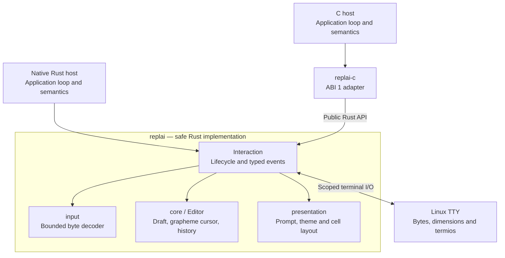

# Architecture and implementation boundary

Status: `REPLAI.INTERACTION.API.ABI.0` (R2). This is an independent, early
terminal interaction library with a working Linux editor. The public Rust
surface is experimental. A separate C binding exposes pre-release ABI 1 through
this public Rust surface. No consumer adapter or application framework exists.

For the classical Read–Eval–Print Loop, the distinction between editing and
parsing, and the host interaction sequence, start with [the REPL guide](repl.md).

## Ownership and structure

Arrows show calls and ownership boundaries, not threads or a scheduler.
The public API delegates to private modules; neither host accesses their
internal decoder or layout state. Read/parse, evaluation and semantic result
formatting remain above both public boundaries.

| Implemented library mechanism | Host responsibility |
| --- | --- |
| Bounded text, grapheme cursor, insertion/deletion and navigation | Meaning, validation and execution of input |
| History navigation and preservation of the current draft | Admission, privacy, persistence, deduplication and retention choices |
| Input decoding, paste framing and key recognition | Application command language |
| Typed submit, interrupt, end-of-input and failure outcomes | Commit, cancel, retry, clear or exit decisions |
| Completion request and validated replacement | Candidates, vocabulary, eligibility, selection and lookup errors |
| Scoped terminal acquisition, restoration, resize and redraw | When editing begins and ends; coordinated access to the terminal |
| Generic style roles, prompt composition, continuation, spacing and line surface | Actual labels, suffix values, messages and their semantic meaning |
| Synchronous external text output with draft/cursor restoration | Content, scheduling and application operations |

R1 refines the initial formatting boundary: **generic terminal presentation is
library-owned**; semantic rendering remains host-owned. Future consumers can
replace their generic prompt/palette/redraw infrastructure instead of retaining
a second terminal template. Terminal I/O is the only library effect; application
storage, filesystem actions, networking and command registries remain external.

Private modules follow demonstrated dependencies:

- `core`: deterministic `Editor`, bounded history and edit errors. No FDs,
  callbacks, signals, clocks, environment reads or process globals.
- `input`: incremental bounded byte decoder producing private key actions.
  Expiration is explicit input from the adapter; no clock lives in this module.
- `presentation`: generic `Prompt`, `Theme`, `Role` and private cell layout.
  Layout consumes core state. Only explicit theme environment resolution reads
  `NO_COLOR`/`TERM`; the renderer itself has no I/O.
- `terminal`: Linux FD/termios lifecycle, polling, interaction events, completion
  transactions and output coordination. No separately exported internal modules.

## Text, cursor and display

Storage and capacities are **UTF-8 bytes**. Every public cursor/range endpoint
must lie on an **extended grapheme boundary**, as determined by
`unicode-segmentation`. Left/Right, Backspace/Delete operate on those clusters.
Insertion/deletion can join adjacent clusters; the cursor advances to the next
valid boundary after the edit. Invalid ranges, controls and capacity overflow
leave the original text and cursor unchanged.

Home/End and Ctrl-A/Ctrl-E refer to the whole input, including multiple logical
lines. Up/Down navigate history, not vertical columns. Input is neither trimmed
nor normalized as Unicode. LF and TAB are accepted text; other Unicode controls
are rejected. Bracketed paste performs the separate newline normalization below.

Layout uses `unicode-width`'s normal (ambiguous-narrow) cell policy per grapheme.
ANSI style sequences are not text and contribute no cells. Draft TAB expands
to four-column stops. CJK wide characters, accented text, combining clusters,
ordinary emoji and joined emoji are covered by core/layout tests. The independent
VT oracle covers the subset it can model; a font or emulator may render a joined
emoji or ambiguous character differently. Full Unicode terminal equivalence,
bidi layout and all terminal width tables are not claimed.

Prompt fields are plain control-free text, at most 1024 bytes each. The label
and optional literal suffix compose as `<Accent>label+suffix><Default> `;
continuations default to `... `. No raw ANSI prompt injection is accepted.
Style roles are Default, Strong, Accent, Dim, Success, Warning and Error. All
SGR values have one authority in `Theme`. No background color or alternate
screen is set. Disabling color emits no SGR, including no reset residue, while
preserving text. `TERM=dumb` follows the reference's color rule; it is **not** a
promise to operate on a terminal that lacks the cursor/erase protocol entirely.

Physical rows are explicitly laid out with CR/LF; full-width boundaries and
wide-character gaps are handled without counting scalars as columns. A logical
newline immediately after a full row does not introduce an extra blank row.
The previous editing rows are erased before redrawing, then the logical cursor
is restored. Normal short end insertion appends directly, preserving the compact
reference rhythm. Ctrl-L explicitly clears the visible screen and redraws.
For drafts taller than the terminal, a cursor-following viewport retains at most
height minus one physical rows; hidden text is retained and still submitted.
Minimum dimensions are two columns and two rows. Resize qualification covers
PTY dimension changes and the VT cell model, not every emulator's scrollback
reflow policy. See [presentation evidence](presentation.md).

## Bounded input and paste

The decoder consumes one byte per poll. UTF-8 staging holds at most four bytes;
escape staging at most 64. Supported CSI/SS3 sequences cover arrows, Home/End,
Delete and bracketed-paste delimiters; listed control keys include Enter,
Ctrl-A/C/D/E/L, Backspace and Tab. Unknown sequences are rejected. Oversized CSI
or OSC sequences drain to their terminator with constant extra memory. A bad
UTF-8 byte and the incomplete scalar containing it are rejected together; the
offending byte is not replayed as a shortcut.

The adapter expires pending sequences after a 250 ms idle interval, observed
while polling. Each poll waits at most 100 ms. This is an idle bound, not a
fixed total sequence length/time guess; tests deliver each byte with a delay
longer than 25 ms. Expired UTF-8/escape input produces `Event::Rejected` and
keeps the draft. Host starvation can delay observation.

Bracketed paste stages one atomic payload, bounded by the editor byte limit,
and recognizes fragmented begin/end markers. CRLF becomes one LF; lone CR and
LF become LF. TAB remains literal text, not completion. Other control characters
reject the **entire** paste; they never execute shortcuts. Oversized payloads
are drained through their end marker, then rejected. The wire-byte bound is
applied before newline normalization, and insertion separately checks remaining
draft capacity. Invalid UTF-8 is rejected. No partial paste is committed.

An incomplete paste or physical EOF during a pending sequence produces a terminal
I/O error and closes/restores the interaction. The host must treat this as a
failed input transaction; automatically reopening on an untrusted remaining
byte stream would erase the framing distinction. Enter outside paste submits
one complete string. Unbracketed LF/CR each mean Enter; automatic detection of
unframed multi-command paste is not promised.

## Terminal and signal ownership

`Interaction::open` validates TTY input and output and requires the same terminal
before changing state. It duplicates the FDs, captures full termios and window
dimensions, enters raw mode with ISIG disabled, enables bracketed paste and draws.
No input queue is flushed. One active interaction per process is admitted;
other opens fail before mutation. The small atomic lease prevents competing
editors but does not install a process-wide signal policy.

Submit, empty-buffer Ctrl-D/read EOF, interruption and explicit close restore
**exactly the captured termios**, not a guessed cooked mode. Read/write errors,
partial acquisition and ordinary unwinding also attempt restoration. Bracketed
paste is disabled and styling reset during cleanup. A failed output FD does not
skip termios restoration; cleanup also tries the same-terminal input FD when
writable. Explicit errors report cleanup failure along with the original error.
Drop is best effort and never panics or exits the process. Disconnected terminals
may reject restoration syscalls, and no library can promise cleanup on SIGKILL,
abort or process termination that bypasses unwinding.

No handlers, signal masks, signal threads or cancellation threads are installed,
so there is no previous handler state to replace or restore. Keyboard Ctrl-C is
a decoded byte yielding `Interrupted`, with a visible `^C` at the end of the
editing surface. OS SIGINT/SIGTERM/SIGTSTP policy stays with the host. A host may
observe its own signals and call `interrupt` or `close`; suspension requires
closing before suspension and opening again after resumption. Resize is observed
by reading current dimensions on each poll, independent of SIGWINCH handlers;
it works even when the host owns or blocks SIGWINCH. Concurrent direct writers
or externally changing terminal modes during an interaction are unsupported.

## Host interaction contract

`Interaction` owns an `Editor` and an independently owned optional terminal
resource. The resource borrows editor state only for each operation, never for
its stored lifetime. This replaces R1 `Terminal<'a>` borrowing an external editor:
an opaque owner can now be moved, closed and reopened without self-references,
raw editor pointers or fabricated lifetimes. `editor()` exposes current text
and byte cursor; `editor_mut()` permits direct host edits only while closed.
Active edits go through validated completion/output operations so display state
cannot become stale. Terminal closure does not clear the editor or admit history.
The host can retain rejected/interrupted/submitted input and choose its next step.

- `Event::Submitted(String)`: Enter; terminal restored.
- `Event::Interrupted`: decoded Ctrl-C or explicit host call; terminal restored.
- `Event::EndOfInput`: physical EOF or Ctrl-D with empty text; terminal restored.
  Ctrl-D with nonempty text deletes the next grapheme (no-op at end).
- `Event::CompletionRequested`: Tab; active draft remains available.
- `Event::Rejected(EditError)`: recoverable input/capacity failure; editing continues.
- `Error::State`: operation unavailable in the current lifecycle.
- `Error::Busy`: another interaction owns the terminal lease.
- `Error::UnsuitableTerminal`: non-TTY, terminal mismatch or unsupported dimensions.
- `Error::Edit`: invalid host edit/output text; unchanged draft, interaction active.
- `Error::Io`: terminal failure; restoration attempted, interaction unavailable
  after successful restoration. A failed restoration is reported.

Completion has no callback registry or candidate type. The host reads text and
cursor, discovers and selects candidates, and calls `complete(range, text)` for
one chosen replacement. Range endpoints must be ordered grapheme boundaries.
Zero candidates, ambiguity, refusal or lookup failure need no mutation. The
same atomic validation applies to Unicode and oversized replacements.

History is configured by entry count and input byte bound. Admission is explicit,
with oldest-entry eviction only when the host-selected bound is full. No hardcoded
history size, persistence, deduplication or privacy policy exists. First Up saves
the current draft **and cursor**; Down past the newest entry restores both.
Editing a recalled entry changes only the current edit. Navigating away discards
that recalled edit, without modifying admitted history.

`external_output(role, text)` is a synchronous display transaction: disable paste
framing, clear the editing rows, write validated host text using a generic role,
finish its line, enable paste and redraw draft/cursor. LF/CRLF are normalized;
other controls except TAB reject before any terminal mutation. There is no raw
ANSI passthrough. Input stays raw and queued bytes are retained. The host controls
when output is written; independent concurrent writes must be serialized through
this method. Partial fragments can be sent as separate lines; continuous
no-newline streaming batches and an unrestricted writer guard are not R1 APIs.

## Dependencies and next boundary

`rustix` owns safe Linux termios/FD/poll calls absent from std. Its PTY feature
is enabled only for tests. `unicode-segmentation` owns extended grapheme boundaries;
`unicode-width` owns Unicode cell estimates, neither supplied by std. `vt100` is
a dev-only independent terminal-state oracle. All four offer the MIT license;
the locked transitive graph also offers MIT. No third-party type leaks into the
public API, no application source dependency exists, and crate unsafe code stays
forbidden. Exact versions and evidence are in [baseline](baseline.md).

R2 adds only `libc` to the binding package for validating ordinary integer FDs
with F_GETFD before constructing a borrowed descriptor. std has no fallible
raw-FD validation operation. Its MIT-compatible license is recorded in the lock
graph; no libc type crosses either public boundary. `replai-c` depends on the
public `replai` crate and owns pointer validation, panic containment and ABI
translation; it cannot access private editor, decoder or frame state. Its
unsafe operations are restricted to the C boundary; `replai` retains
`unsafe_code = "forbid"`. See [C API](c-api.md) for mechanical ownership,
installation, threading, numeric contracts and executable qualification.

Native breaking changes are limited to replacing the lifetime-bound Terminal
with Interaction and adding typed lifecycle/busy/unsuitable-terminal errors.
They solve movable opaque ownership and machine-readable C error mapping.
The host loop, editor policies and single renderer remain unchanged. R2 does
not cut over any consumer. A later, separately authorized integration must pin
an exact qualified revision and retain product semantics in its own adapter.
