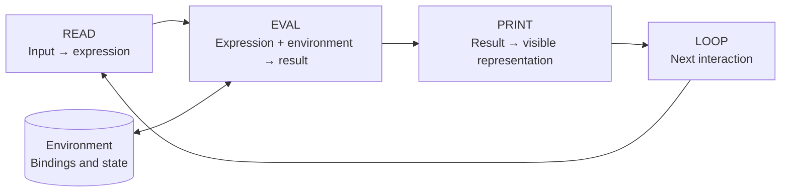
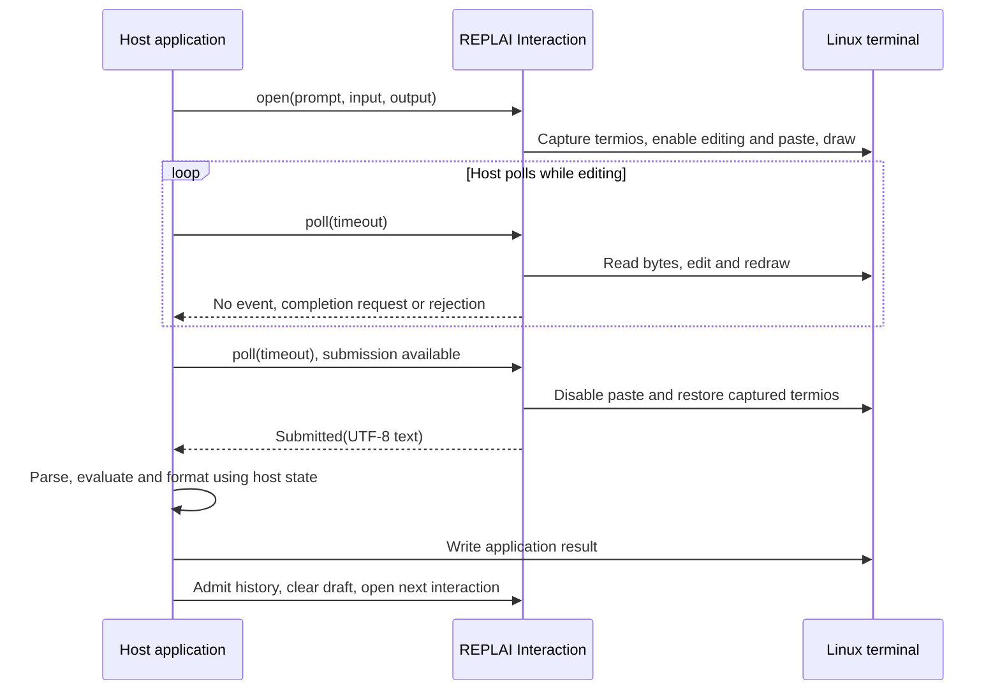

# The classical REPL and REPLAI

This is the teaching entry point. [Architecture](architecture.md) owns the
implemented contracts; [presentation](presentation.md) and [C qualification](c-api.md)
own executable evidence. The diagrams explain responsibilities, not additional
features or a claim of standards conformance.

## Read, evaluate, print, repeat

In the classical interpreter cycle, **Read** constructs an expression from input,
**Eval** computes its meaning in an environment, and **Print** presents the
result. **Loop** returns control to the next interaction. SICP's evaluator
driver provides this concrete decomposition; its explicit-control version also
shows error reporting followed by a return to the driver.
See [SICP §4.1.4](https://sicp.sourceacademy.org/chapters/4.1.4.html) and
[§5.4.4](https://sicp.sourceacademy.org/chapters/5.4.4.html).

For example, a Scheme-style interpreter might read `(+ x 1)`, look up `x = 4`
in its environment, evaluate the addition, and print `5`. That example describes
an interpreter supplied by an application; the REPLAI demo only echoes text.

The driver also needs policies for EOF, interruption and errors. Returning to a
prompt after an error does not itself undo earlier application effects. A
debugger or database shell can follow the same interaction pattern while using
its own command reader and execution semantics.

## The terminal editor is one part of Read

A terminal delivers bytes and control sequences. An editor turns those into an
editable draft. A language reader/parser then decides what the submitted text
means and whether it is complete. Enter, balanced parentheses, and a complete
expression are not interchangeable concepts.

GNU Readline provides an established example of this separation: the application
calls the editing library to obtain a line, then processes that text itself.
This is an architectural comparison, not source ancestry, license equivalence
or Readline API compatibility.
See [Programming with GNU Readline](https://web.mit.edu/gnu/doc/html/rlman_2.html).

| Stage | REPLAI supplies | Host supplies |
| --- | --- | --- |
| Acquire input | Prompt mechanics, Unicode editing, history navigation, paste, redraw | Prompt text, history admission and completion choices |
| Read an expression | Submitted UTF-8 text, possibly containing multiple lines | Parsing, completeness checks and validation |
| Evaluate | No evaluator | Meaning, execution and application state |
| Print | Generic text roles and coordinated notices while editing | Result representation and application output |
| Loop | Typed events and explicit terminal lifecycle | Event dispatch, retry, execution, reopen and exit policy |

REPLAI does not infer language completeness. A bracketed multiline paste stays
one draft until submission; its newlines do not execute separate commands.

## One interaction in the implemented library

This sequence is the host pattern used by the [Rust fixture](../examples/demo.rs)
and exposed through the [C binding](c-api.md). Both use the same editor and
renderer; the C binding does not contain another terminal implementation.

Completion keeps the interaction open: the host reads draft and cursor, selects
a replacement and calls `complete`; REPLAI validates its boundaries and redraws.
An interrupt or EOF is a distinct outcome that restores the terminal. Terminal
I/O failures attempt restoration and report errors; they are not submitted text.

During editing, `external_output(role, text)` writes a validated notice and
restores the draft and cursor. It leaves input in editing mode and completes a
line. For ordinary execution output, a host can use the terminal after submission
has closed the interaction, then reopen it. These are different lifecycles;
the library does not install an application scheduler or take over the loop.

## References and what they establish

- **John McCarthy (1960), _Recursive Functions of Symbolic Expressions and Their
  Computation by Machine, Part I_.** Historical foundation for symbolic
  evaluation and the eval/apply construction; not a specification of a
  modern terminal editor. [Author-hosted paper](https://www-formal.stanford.edu/jmc/recursive/recursive.html).
- **Harold Abelson and Gerald Jay Sussman, with Julie Sussman, _Structure and
  Interpretation of Computer Programs_, second edition (1996), §§4.1.4 and
  5.4.4.** The evaluator driver and its control flow are the teaching references
  above. Links use the Comparison Edition, which presents the original Scheme
  beside its JavaScript adaptation.
- **Free Software Foundation, _GNU Readline Library_, “Programming with GNU
  Readline”.** Reference for the application/editor boundary; the linked MIT
  mirror hosts the library manual. It does not establish compatibility with
  REPLAI's event API.

The explanations and diagrams here are original summaries. REPLAI's actual
ownership and behavior are established by its source and tests, not by citing
these works.
